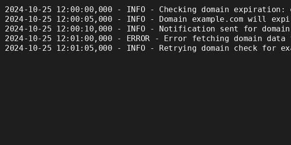
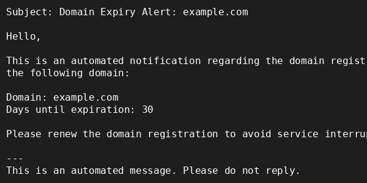
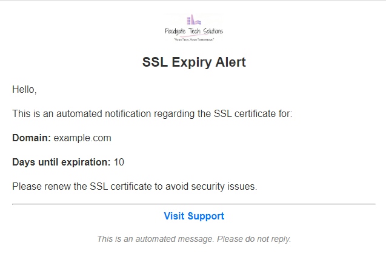
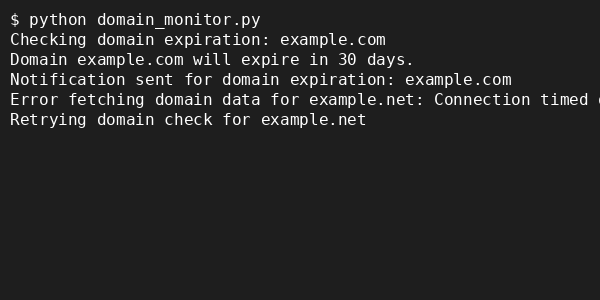

# Webmin Domain and SSL Expiry Monitoring Script with Jinja2 Templated Alerts & Comprehensive Error Handling


# 


## Table of Contents
- [Introduction](#introduction)
- [Version Information](#version-information)
  - [Current Version: v2.0.0rc](#current-version-v200rc-released-on-2024-10-21)
  - [Notable Changes](#notable-changes)
- [Features](#features)
- [Why Use This Script?](#why-use-this-script)
- [Quick Start Guide](#quick-start-guide)
  - [Step 1: Clone the Repository](#step-1-clone-the-repository)
  - [Step 2: Install Python Dependencies](#step-2-install-python-dependencies)
  - [Step 3: Set Up Environment Variables](#step-3-set-up-environment-variables)
  - [Step 4: Verify Template Files](#step-4-verify-template-files)
  - [Step 5: Run the Script](#step-5-run-the-script)
  - [Step 6: Enable Continuous Loop Mode (Optional)](#step-6-enable-continuous-loop-mode-optional)
  - [Step 7: Basic Usage](#step-7-basic-usage)
  - [Step 8: Set Up as a Systemd Service (Optional)](#step-8-set-up-as-a-systemd-service-optional)
  - [Step 9: Set Up as a Cron Job (Optional)](#step-9-set-up-as-a-cron-job-optional)
  - [Step 10: Review Logs and Monitor Alerts](#step-10-review-logs-and-monitor-alerts)
- [Detailed Configuration Guide](#detailed-configuration-guide)
  - [Setting Up Webmin API](#setting-up-webmin-api)
  - [Setting Up the Environment File](#setting-up-the-environment-file)
  - [Email Template Customization](#email-template-customization)
  - [Additional Information on Configuration Variables](#additional-information-on-configuration-variables)
- [Example Outputs](#example-outputs)
  - [1. Sample Log Output](#1-sample-log-output)
  - [2. Sample Email Alert (Plain Text & HTML)](#2-sample-email-alert-plain-text--html)
  - [3. Sample Command-Line Output](#3-sample-command-line-output)
- [Testing](#testing)
  - [1. Unit Tests](#1-unit-tests)
  - [2. Coverage Testing](#2-coverage-testing)
  - [3. Static Analysis](#3-static-analysis)
  - [4. Multi-Version Testing](#4-multi-version-testing)
  - [5. CI/CD Pipeline Testing](#5-cicd-pipeline-testing)
- [CI/CD Integration](#cicd-integration)
  - [Key Features of the CI/CD Pipeline](#key-features-of-the-cicd-pipeline)
  - [How It Works](#how-it-works)
- [Contributing](#contributing)
  - [How to Contribute](#how-to-contribute)
  - [Contribution Guidelines](#contribution-guidelines)
- [Common Issues](#common-issues)
- [Author](#author)
- [Release Notes](#release-notes)
  - [Changelog for v2.0.0rc](#changelog-for-v200rc)
    - [🚀 Major Enhancements](#-major-enhancements)
    - [🛠️ Improvements](#️-improvements)
    - [🐛 Bug Fixes](#-bug-fixes)

## Introduction
This Python script helps administrators monitor the expiration of SSL certificates and domain registrations for domains managed by Webmin/Virtualmin servers. It interacts with the Webmin API, fetches the list of domains, checks their SSL and domain registration expiration dates, and logs warnings if they are close to expiry. It also updates a local file (`domains.txt`) to track current domains and logs any changes. The script uses Jinja2 for templating and full customization of the email alerts.

It supports both single-run and continuous execution modes and can be set up as a systemd service or cron job for automated execution. The script includes error handling with retries and exponential backoff to manage network issues effectively.

This script now uses a **modular design**, with different modules handling configuration, domain operations, notifications, and logging, enhancing maintainability and scalability. It also now handles additional domains not hosted on a Webmin server (user configurable via the `.env` file).

## Version Information

### Current Version: v2.0.0rc (Released on 2024-10-21)

#### Notable Changes:
- **CI/CD Integration**:
  - **Implemented**: automated unit testing, static code analysis, multi-version compatibility checks, and test coverage reporting.
  - **Multi-Version Testing**: now supports Python `3.8`, `3.9`, `3.10`, **`and 3.11`**, providing broader compatibility assurance.
- **Dynamic Batch Size Calculation**: Automatically adjusts batch sizes based on API rate limits, processing time, and delay settings, offering improved scalability and performance.
- **Enhanced Concurrency**: The new release optimizes parallel processing using threading, enabling faster domain monitoring for large lists.
- **Advanced Error Handling**: Added custom exceptions and comprehensive try-catch blocks to improve robustness and error resilience across modules.
- **Improved Notification System**: Added support for logo URLs and support URLs in email templates, providing branded and informative alerts.
- **Detailed Documentation**: Updated README, contributing guidelines, and environment variable descriptions for easier setup and configuration.
> **For full details**, please see the [Release Notes](RELEASE_NOTES.md) and [Changelog](https://github.com/ripcdoc/virtualmin-domains-expiry-monitor/compare/v1.1.1...v2.0.0rc).

## Features
- **Concurrent Domain Monitoring**: Uses threading to check multiple domains simultaneously.
- **Batch Processing**: Processes domains in batches to manage API load and prevent rate limits.
- **Static Analysis and Unit Testing**: Integrated tools for code quality and robustness, ensuring reliability.
- **Multi-Version Testing**: Supports Python 3.8, 3.9, 3.10, and 3.11 (if included in CI/CD) to ensure compatibility.
- **Modular Architecture**: The script is structured into separate modules:
  - `config.py`: Manages configuration loading from the `.env` file.
  - `domain_operations.py`: Handles domain retrieval from Webmin servers and includes support for additional domains.
  - `notifications.py`: Manages email alerts using Jinja2 templates.
  - `logger.py`: Sets up centralized logging.
  - `domain_monitor.py`: Acts as the main controller to orchestrate the workflow.
- **Fetch Domain List from Webmin API**: Automatically retrieves the list of domains from one or more Webmin servers using the Webmin API.
- **SSL Certificate Expiration Check**: Checks SSL certificate expiration dates and logs warnings if certificates are close to expiry.
- **Domain Registration Expiration Check**: Verifies domain registration expiration dates and logs warnings if registrations are near expiry.
- **Automatic Domain Management**: Updates the local domain file (`domains.txt`) by adding new domains and removing deleted ones.
- **Support for Additional Domains**: Users can specify additional domains to be monitored by setting the `ADDITIONAL_DOMAINS` variable in the `.env` file.
- **Customizable Email Alerts with Jinja2 Templates**: Sends HTML and plain-text email alerts using Jinja2 templates. Users can customize the templates (`email_html.j2` and `email_plain.j2`) for SSL and domain expiration notifications.
- **Comprehensive Error Handling**: 
  - Uses custom error classes (e.g., `WebminAuthError`, `WebminServerError`, `WebminConnectionError`) to manage specific errors, differentiating between authentication, server, and connection issues.
  - Implements persistent error alerts that trigger email notifications when errors occur consecutively beyond a defined threshold (`ERROR_ALERT_THRESHOLD`).
- **Enhanced Logging**: 
  - Logs all events, including SSL and domain checks, additions, removals, and errors encountered during execution.
  - Log entries are stored in a rotating log file (`webmin_domains.log`), which helps manage log size and maintain historical records.
- **Retry Mechanism for API Calls**: Includes a retry mechanism that handles temporary network failures, automatically retrying failed API calls up to a specified number of attempts (`MAX_RETRIES`), with exponentially increasing wait times.
- **Parallel Processing with Dynamic Worker Allocation**: Optimizes concurrent processing of API calls by dynamically determining the number of workers based on available CPU cores, reducing execution time.
- **Configurable**: 
  - Easily configure Webmin server URLs, API credentials, alert thresholds, retry attempts, and more through the `.env` file.
  - New feature: Automatic batch size calculation based on API rate limits and processing time.
  - Allows customization of alert thresholds for SSL and domain expiration to tailor the notification schedule.
- **Continuous Execution Option**: 
  - Provides the option to switch between single-run and continuous loop modes. 
  - In continuous loop mode, the script runs indefinitely, checking domain and SSL expiration at regular intervals (`CHECK_INTERVAL`).
  - Can be integrated with systemd for automatic startup or set up as a cron job for scheduled execution in single-run mode.
- **Systemd Service Integration**: Configurable as a systemd service for continuous monitoring, with automatic restart capabilities and service management through systemd commands.
- **Cron Job Setup**: Can be run periodically in single-run mode using a cron job, allowing for scheduled execution at specific times.

## Why Use This Script?
- **Proactive Monitoring**: Sends alerts well in advance of domain or SSL expiration to prevent downtime, security risks, or unexpected loss of domain ownership. Alerts are configurable based on user-defined thresholds, ensuring ample time for remediation.
- **Automated Updates**: Automatically syncs the domain list from Webmin, removing the need for manual domain management.
  - **Note:** The `domains.txt` file, which stores the list of domains, will be created automatically during the first run if it doesn't already exist. This ensures seamless initialization and operation without any additional setup.
- **Flexible and Extendable**: Written in a modular way, making it easy to customize or add additional features.
- **Simple to Use**: Easy setup with basic Python knowledge, making it a valuable tool for administrators managing Webmin servers.

## Quick Start Guide

### Step 1: Clone the Repository

1. Clone the repository to your local machine:
   ```bash
   git clone https://github.com/ripcdoc/virtualmin-domains-expiry-monitor.git
   cd virtualmin-domains-expiry-monitor
   ```

### Step 2: Install Python Dependencies

1. Ensure you have Python 3.8 or higher installed (3.11 recommended).
2. Install the required packages from the `requirements.txt` file:
   ```bash
   python -m pip install -r requirements.txt
   ```

### Step 3: Set Up Environment Variables

1. Copy the sample environment file and rename it:
   ```bash
   cp .env.sample .env
   ```
2. Open the `.env` file and configure the following variables:
   - **Webmin server URLs and API keys**: Set `WEBMIN_SERVERS` & `WEBMIN_API_KEYS`.
   - **Batch processing settings**: Adjust variables like `BATCH_SIZE`, `API_RATE_LIMIT`, `AVG_PROCESSING_TIME`, etc.
   - **Email settings**: Configure variables like `EMAIL_SENDER`, `EMAIL_RECIPIENT`, `SMTP_SERVER`, etc.
   - **Other settings**: Customize SSL alert days, domain expiration days, retry settings, etc., as needed.

> **Note (Webmin API)**: Ensure proper API access is configured in your Webmin control panel. See [Setting up Webmin API](#setting-up-webmin-api) in the **Detailed Configuration Guide** section for instructions.

> **Note (`.env` File)**: See [Setting up the Environment File](#setting-up-the-environment-file) in the **Detailed Configuration Guide** section for detailed explanation of `env` file and **all** variables.

### Step 4: Verify Template Files

1. Check the `templates/` directory for the default email templates:
   - `email_html.j2`
   - `email_plain.j2`
2. If needed, create customized templates and update the `.env` file accordingly.

### Step 5: Run the Script

1. Execute the script to check domain and SSL expiration:
   ```bash
   python domain_monitor.py
   ```
2. Check the console output and the log file (`webmin_domains.log`) to ensure proper execution.

### Step 6: Enable Continuous Loop Mode (Optional)

1. Open the `domain_monitor.py` script.
2. Locate the following lines near the end of the script:
   ```python
   if __name__ == "__main__":
       main()  # Default single-run mode
       # continuous_loop()  # Uncomment this line to enable continuous loop mode
   ```
3. Uncomment the `continuous_loop()` line and comment out the `main()` line.
4. Save the script and run it:
   ```bash
   python domain_monitor.py
   ```

### Step 7: Basic Usage

- **Run the Script Once**: Use the following command to run the script in single-run mode:
  ```bash
  python domain_monitor.py
  ```
- **Continuous Monitoring**: 
  - Enable continuous monitoring by following the steps in "Enable Continuous Loop Mode" above.
- **Log Outputs**: 
  - Check `webmin_domains.log` for detailed logs of domain checks, SSL expiration, and any errors encountered.

### Step 8: Set Up as a Systemd Service (Optional)

If using continuous loop mode, you can run the script as a **systemd service**:

1. Create a systemd service file:
   ```bash
   sudo nano /etc/systemd/system/webmin-monitor.service
   ```
2. Add the following configuration:
   ```ini
   [Unit]
   Description=Webmin Domain and SSL Monitoring Script (Continuous)
   After=network.target

   [Service]
   Type=simple
   User=your-username
   WorkingDirectory=/path/to/your/script/
   ExecStart=/usr/bin/python3 /path/to/your/script/domain_monitor.py
   Restart=always
   RestartSec=10
   EnvironmentFile=/path/to/your/script/.env

   [Install]
   WantedBy=multi-user.target
   ```
   - Replace `your-username` and `/path/to/your/script/` accordingly.

3. Enable and start the service:
   ```bash
   sudo systemctl enable webmin-monitor.service
   sudo systemctl start webmin-monitor.service
   ```

### Step 9: Set Up as a Cron Job (Optional)

If using single-run mode, set up a cron job to run the script periodically:

1. Open the crontab editor:
   ```bash
   crontab -e
   ```
2. Add the cron job entry:
   ```bash
   0 2 * * * /usr/bin/python3 /path/to/your/script/domain_monitor.py >> /path/to/your/log/webmin_domains.log 2>&1
   ```

### Step 10: Review Logs and Monitor Alerts

- Check the log file for any errors or warnings:
  ```bash
  tail -f webmin_domains.log
  ```
- Monitor email alerts for SSL or domain expirations.

> **Troubleshooting**: If you encounter issues, refer to the **Troubleshooting** section below.

## Detailed Configuration Guide

### Setting Up Webmin API

Before running the script, ensure that the Webmin API is properly configured:

1. **Enable Webmin Remote API**:
   - Log into Webmin as an administrator.
   - Navigate to **Webmin Configuration** > **Webmin Modules** > **Remote API**.
   - Check “Enable Remote API” to allow API access.

2. **Create an API User or Token**:
   - Go to **Webmin Users** > **Create a new Webmin User**.
   - Assign a username and a strong password or API token.
   - Ensure the user has access to the **Virtualmin Module** or **Domain Management**.

3. **Set Permissions**:
   - Allow read access to domain and SSL certificate information.
   - Configure “API-only access” for improved security.

4. **Firewall Settings**:
   - Allow incoming traffic on port 10000 (or the configured Webmin port).
   - Add IP allowlists or rules to allow access only from trusted IPs.

5. **Verify API Endpoint and Keys**:
   - The endpoint format should be: `https://<webmin-server>/virtual-server/remote.cgi`.
   - Set `WEBMIN_SERVERS` and `WEBMIN_API_KEYS` variables in the `.env` file.

### Setting Up the Environment File

> **Important:** Ensure the `.env` file is secured and not exposed publicly, as it contains sensitive information like API keys and credentials.
> 
> **Important:** Ensure that the `.env` file contains all the required variables. Below is the complete list of environment variables:

```env
# Webmin server URLs (comma-separated)
WEBMIN_SERVERS=https://webmin1.example.com,https://webmin2.example.com

# Corresponding API keys for Webmin servers
WEBMIN_API_KEYS=api_key1,api_key2

# Additional domains to monitor (comma-separated)
ADDITIONAL_DOMAINS=example.com,anotherexample.com

# Batch size settings
BATCH_SIZE=5                    # Override automatic batch size calculation
API_RATE_LIMIT=100              # Max API requests per interval
RATE_LIMIT_INTERVAL=60          # Duration of the rate limit interval in seconds
AVG_PROCESSING_TIME=0.5         # Avg processing time per domain in seconds
MAX_BATCH_SIZE=20               # Upper limit for batch size

# Email configuration for sending alerts
EMAIL_SENDER=noreply@example.com
EMAIL_RECIPIENT=admin@example.com
SMTP_SERVER=smtp.example.com
SMTP_PORT=587
SMTP_USER=user
SMTP_PASS=pass

# Log file settings
LOG_FILE_PATH=webmin_domains.log
LOG_LEVEL=INFO                  # Log levels: DEBUG, INFO, WARNING, ERROR, CRITICAL

# SSL and domain expiration alert thresholds
SSL_WARNING_DAYS=30             # SSL alert threshold in days
DOMAIN_EXPIRATION_ALERT_DAYS=45 # Domain expiration alert threshold in days

# Retry configuration for network requests
MAX_RETRIES=5                   # Maximum retries for failed API calls
RETRY_DELAY=5                   # Initial delay for retries in seconds

### Persistent Error Handling Settings
- **ERROR_ALERT_THRESHOLD**: Sets the number of consecutive errors required to trigger a persistent error alert. If the same error occurs for this many times, an alert is sent.
- **MAX_RETRIES**: Determines how many times the script will retry an API call in case of a failure.

# Template directory
TEMPLATE_DIR=./templates

# Customizable email templates
EMAIL_HTML_TEMPLATE=email_html.j2
EMAIL_PLAIN_TEMPLATE=email_plain.j2

# Interval for checks in continuous mode
CHECK_INTERVAL=3600             # Time interval for continuous mode in seconds

# Support and logo URLs for notifications
SUPPORT_URL=https://support.example.com
LOGO_URL=https://example.com/logo.png
```

### Email Template Customization

The email templates used for sending alerts are located in the `templates` directory and are rendered using Jinja2. You can modify these templates to match your organization’s branding and preferred format.

#### 1. Modifying the HTML Email Template (`email_html.j2`)

- The HTML template includes a placeholder image at the top, which can be replaced with your organization’s logo.
  - To update the logo, edit the `src` attribute of the `` tag in the `email_html.j2` file:
    ```html
    
    ```
  - Update the `LOGO_URL` environment variable in the `.env` file to point to your desired logo URL:
    ```env
    LOGO_URL=https://yourdomain.com/path/to/logo.png
    ```

#### 2. Customizing Plain Text Email Template (`email_plain.j2`)

- The plain text template can be modified to adjust the text content of email alerts. Open `email_plain.j2` and edit the message body as needed.

#### 3. Additional Template Variables

- Both templates use variables defined in the script, such as `domain`, `days_until_expire`, and `SUPPORT_URL`.
  - You can add new variables to the templates and update the Python code accordingly to pass additional context.
  - To update the support link, modify the `SUPPORT_URL` environment variable:
    ```env
    SUPPORT_URL=https://support.yourdomain.com
    ```

#### 4. Previewing Changes

- After modifying the templates, run the script locally to send test emails and ensure that the templates render correctly.
- Check both HTML and plain text formats in your email client to confirm that the changes are displayed as expected.
- After modifying templates, consider running unit tests or sending test alerts to verify changes before deploying them in production.

> **Note:** Make sure the Jinja2 syntax in the templates is correct to avoid rendering errors in the email notifications.

### Additional Information on Configuration Variables

- **Webmin Server Configuration**:
  - Ensure that `WEBMIN_SERVERS` and `WEBMIN_API_KEYS` lists are aligned in the same order.
- **Batch Size Settings**:
  - The batch size is dynamically adjusted based on `API_RATE_LIMIT`, `AVG_PROCESSING_TIME`, and `RATE_LIMIT_INTERVAL`.
    - Example: If `API_RATE_LIMIT` is set to 100 and `AVG_PROCESSING_TIME` is set to 0.5 seconds, the calculated batch size will be adjusted accordingly to maximize processing efficiency within the rate limits.
  - `MAX_BATCH_SIZE` sets an upper limit to prevent overloading.

- **Email Configuration**:
  - Set up the SMTP variables (`EMAIL_SENDER`, `EMAIL_RECIPIENT`, etc.) to enable alert sending.
- **Alert Thresholds**:
  - Adjust `SSL_WARNING_DAYS` and `DOMAIN_EXPIRATION_ALERT_DAYS` to define alert times.
- **Retry Configuration**:
  - `MAX_RETRIES` controls retry attempts, and `RETRY_DELAY` defines the wait time between retries.
- **Persistent Error Alerts**:
  - Set `ERROR_ALERT_THRESHOLD` to trigger alerts for repeated errors.
- **Customizable Email Templates**:
  - Use Jinja2 templates specified by `EMAIL_HTML_TEMPLATE` and `EMAIL_PLAIN_TEMPLATE` to customize alerts.
- **Support and Logo URLs**:
  - Add URLs for support and logo to enhance the branding of email notifications.

## Example Outputs

### 1. Sample Log Output
```
2024-10-25 12:00:00,000 - INFO - Checking domain expiration: example.com
2024-10-25 12:00:05,000 - INFO - Domain example.com will expire in 30 days.
2024-10-25 12:00:10,000 - INFO - Notification sent for domain expiration: example.com
2024-10-25 12:01:00,000 - ERROR - Error fetching domain data for example.net: Connection timed out
2024-10-25 12:01:05,000 - INFO - Retrying domain check for example.net
```



> **Note**: Log entries may vary depending on configuration settings, network conditions, and API responses.

### 2. Sample Email Alert (Plain Text & HTML)
```
Subject: Domain Expiry Alert: example.com

Hello,

This is an automated notification regarding the domain registration for the following domain:

Domain: example.com
Days until expiration: 30

Please renew the domain registration to avoid service interruptions.

---
This is an automated message. Please do not reply.
```




### 3. Sample Command-Line Output
```
$ python domain_monitor.py
Checking domain expiration: example.com
Domain example.com will expire in 30 days.
Notification sent for domain expiration: example.com
Error fetching domain data for example.net: Connection timed out
Retrying domain check for example.net
```



## Testing

### 1. Unit Tests
Run unit tests using `pytest` to verify the functionality of the modules:
```bash
pytest tests/
```

### 2. Coverage Testing
To measure test coverage, use the `coverage` module integrated with `pytest`:
```bash
coverage run -m pytest
coverage report -m  # Display the coverage report in the terminal
coverage html       # Generate an HTML coverage report
```
> The CI pipeline automatically uploads coverage reports to **Codecov**. You can view detailed coverage reports on the Codecov dashboard.

### 3. Static Analysis
Run `flake8` and `pylint` for code quality checks:
```bash
flake8 .
pylint **/*.py
```

### 4. Multi-Version Testing
Use `tox` to run tests across multiple Python versions (3.8, 3.9, 3.10, 3.11):
```bash
tox
```
> This command mirrors the multi-version testing performed in the CI pipeline, ensuring compatibility across supported Python versions.

### 5. CI/CD Pipeline Testing
The CI/CD pipeline performs:
- **Automated unit testing** for each push and pull request.
- **Multi-version testing** using `tox`.
- **Coverage testing** with results uploaded to **Codecov** for analysis.


## CI/CD Integration

The CI/CD pipeline is configured using **GitHub Actions** and is designed to automate testing, coverage reporting, and code quality checks.

### Key Features of the CI/CD Pipeline

- **Static Analysis**: 
  - Runs `flake8` and `pylint` to ensure code quality and adherence to Python best practices.

- **Multi-Version Testing**: 
  - Tests the code across Python 3.8, 3.9, 3.10, and 3.11 using `tox`.
  - This ensures compatibility and consistent behavior across supported Python versions.

- **Unit Testing**: 
  - Uses `pytest` to validate functionality across modules.
  - Unit tests are executed for each supported Python version.

- **Coverage Testing**: 
  - Uses the `coverage` module to measure test coverage during the CI pipeline run.
  - Coverage reports are uploaded to **Codecov** for analysis, providing insights into code coverage metrics.

### How It Works
- The CI/CD pipeline is triggered on:
  - **Pushes** to the `main` or `development` branches.
  - **Pull requests** targeting the `main` or `development` branches.

- The pipeline performs the following steps:
  1. **Check out code** from the repository.
  2. **Set up Python** for the specified versions.
  3. **Install dependencies** from `requirements.txt`.
  4. **Run static analysis**, unit tests, and coverage checks.
  5. **Upload coverage results** to Codecov.

> The CI/CD pipeline ensures that all new changes are automatically tested and verified, reducing the likelihood of issues in production.

## Contributing

We welcome contributions from the community! Please follow the guidelines outlined in the [CONTRIBUTING.md](CONTRIBUTING.md) file to ensure a smooth process.

### How to Contribute

1. **Open an Issue**: 
   - If you encounter a bug or have a feature request, please open an issue on GitHub.
   - Clearly describe the problem or feature, providing relevant details and examples.

2. **Submit a Pull Request**:
   - Fork the repository and create a new branch for your changes.
   - Make your changes, ensuring code quality by running unit tests, static analysis, and multi-version testing.
   - Submit a pull request to the `development` branch, following the guidelines in `CONTRIBUTING.md`.

### Contribution Guidelines

- Follow the coding standards described in the `CONTRIBUTING.md` file.
- Ensure that your changes pass all CI/CD checks before submission.
- Be respectful and constructive in discussions; please review the [CODE_OF_CONDUCT.md](CODE_OF_CONDUCT.md).

> For more details, please refer to the [CONTRIBUTING.md](CONTRIBUTING.md) file.

## Common Issues
If you encounter issues while running the script, consider the following solutions:
- Ensure all environment variables are set correctly in the `.env` file and check for missing or incorrectly formatted variables.
- Verify that the Webmin servers are accessible and that the API keys are valid. Make sure the servers are online and that there are no network restrictions.
- Check the logs (`webmin_domains.log`) for detailed error messages and identify potential issues.
- If you encounter authentication errors, review the API permissions in Webmin and ensure the user has adequate access.

## Author
- **Dr. Peter O'Hara-Diaz**
- Contact: [po@floodgatetech.com](mailto:po@floodgatetech.com)

## Release Notes
**For detailed release notes of the latest version, including new features, improvements, and bug fixes, please see the [Release Notes](RELEASE_NOTES.md).**

### Changelog for v2.0.0rc

#### 🚀 Major Enhancements
- **Dynamic Batch Size Calculation**: Automatically adjusts batch size for domain checks based on API limits and processing time.
- **Parallel Processing with Threading**: Improved performance by enabling concurrent checks using threading.
- **Advanced Error Handling**: Added custom exceptions and try-catch blocks to improve error resilience.
- **CI/CD Integration**: Implemented automated testing, coverage reporting, and multi-version testing.
- **Enhanced Notification System**: Added support for branded email templates with support and logo URLs.

#### 🛠️ Improvements
- Detailed comments and documentation added to environment configuration.
- Revised README with new sections for setup, configuration, and performance features.
- Optimized logging with more descriptive messages and log level control.

#### 🐛 Bug Fixes
- Resolved missing variables in the environment file.
- Fixed silent failures by improving error propagation and logging.

## License
This project is licensed under the MIT License. See the [LICENSE](LICENSE) file for details.
